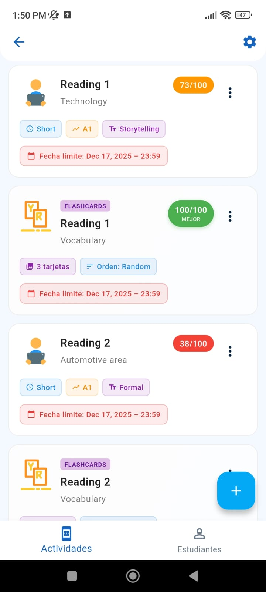
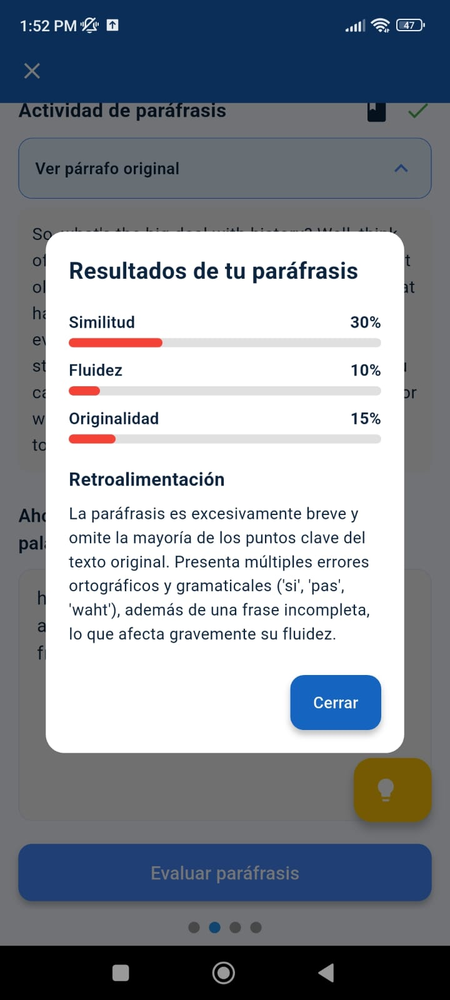
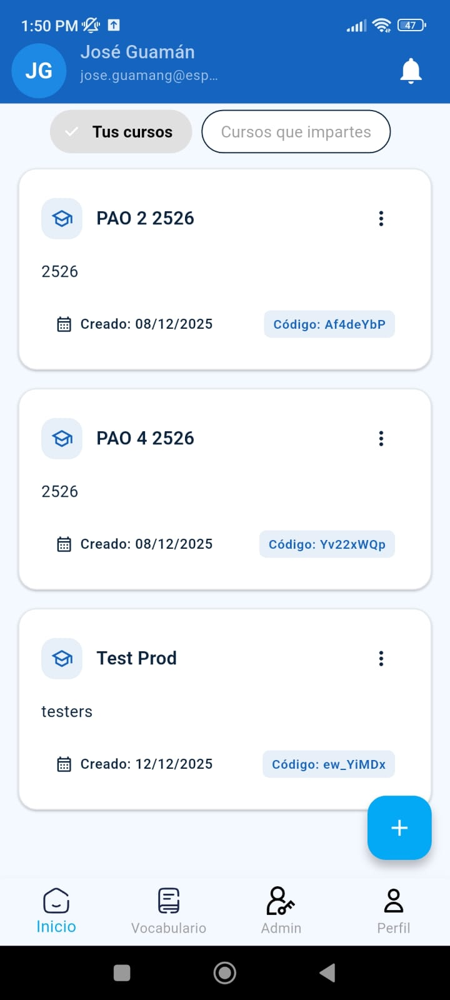
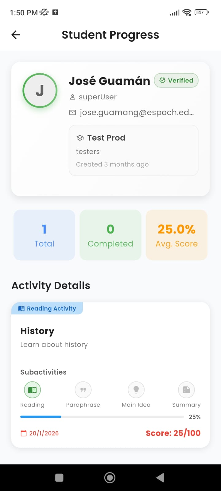
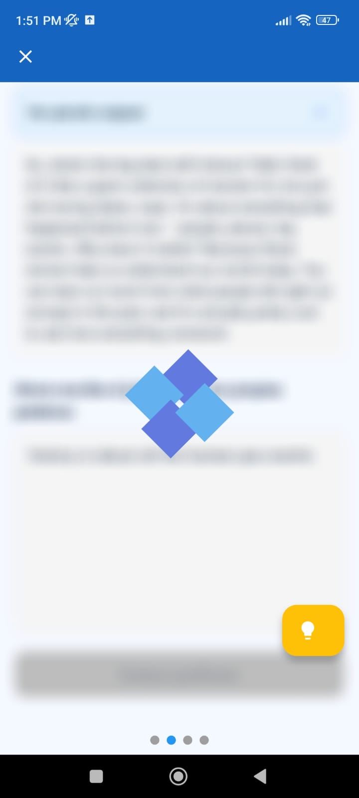
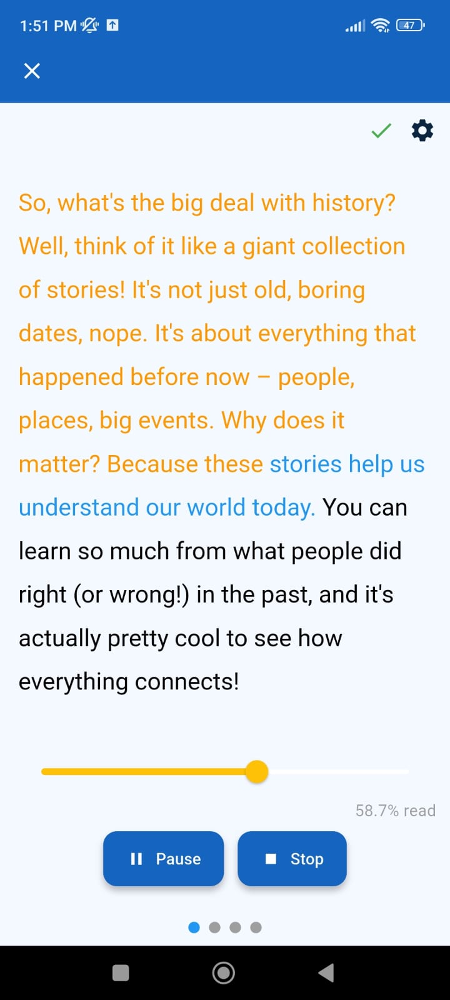
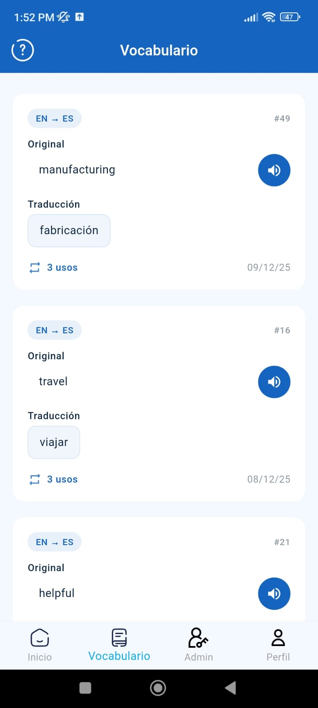

# 📚 ReadMind AI

## 🎯 Propósito del Proyecto
 Aplicación móvil desarrollada en Flutter diseñada para mejorar las habilidades de comprensión lectora mediante el análisis de textos y evaluaciones interactivas, aplicando técnicas como: parafraseo, identificación de ideas principales y realización de resumenes. Todo creado y evaluado dinamicamente con la ayuda de la API de Gemini.

## 📱 Plataformas Disponibles

*Actualmente disponible exclusivamente para dispositivos **Android**.*

## 📸 Demostración Visual

| Actividades | Resultado IA | Cursos |
| :---: | :---: | :---: |
|  |  |  |

| Dashboard | Procesando | Lectura | Vocabulario |
| :---: | :---: | :---: | :---: |
|  |  |  |  |
